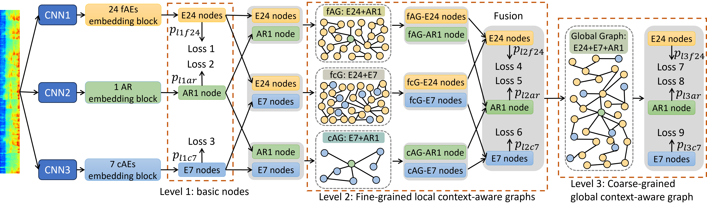
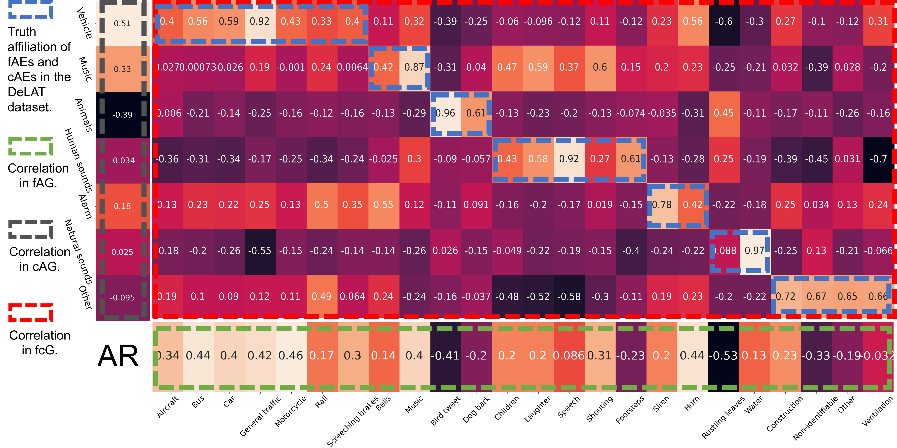
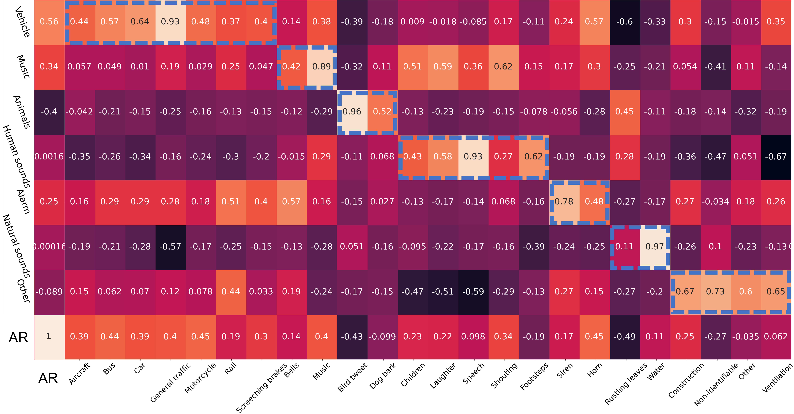

# Multi-level graph learning (MLGL) 

The MLGL is uploading....

<h3 align="center"> The proposed lightweight attention-fused multi-level graph learning (MLGL). <p></p></h3>
<div align="center">
 
</div>  


<h3 align="center"> Fig. 2: (a) Correlation between node embeddings of multiple LcGs. <p></p></h3>
<div align="center">
 
</div>  


<h3 align="center"> Fig. 2: (b) Correlation between node embeddings of the GcG. <p></p></h3>
<div align="center">
 
</div>  

# Run models

```1) Unzip the Dataset under the application folder```

```2) Unzip the Pretrained_models under the application folder```

```3) Enter the application folder: cd application```

## 1) Multi-level predictions of MLGL for AEC and ARP
```python 
python inference_MLGL_3_levels.py
----------------------------------------------------------------------------------------
Loading data time: 0.656 s
Split development data to 2200 training and 245 validation data and 445 test data. 
Number of 445 audios in testing
AEC 24 classes of fAEs:
	level 1 Acc: 0.9191011235955057,  AUC: 0.9179580247709974
	level 2 Acc: 0.9190074906367042,  AUC: 0.9200157437353879
	level 3 Acc: 0.9195692883895131,  AUC: 0.9206666156627457
AEC 7 classes of cAEs:
	level 1 Acc: 0.8471910112359551,  AUC: 0.9098863636363642
	level 2 Acc: 0.8497592295345104,  AUC: 0.9103030303030312
	level 3 Acc: 0.849438202247191,  AUC: 0.9121969696969697
ARP:
	level 1 mse_loss: 1.0618256704746445,  mae_loss: 0.7669948252774356, r2: 0.4519510651373152
	level 2 mse_loss: 0.9643998833119938,  mae_loss: 0.7172525859039821, r2: 0.5022362488236182
	level 3 mse_loss: 0.9395196263112058,  mae_loss: 0.7059113823644231, r2: 0.5150779032755175
```

## Model parameters
```python 
python model_params.py  
----------------------------------------------------------------------------------------
Parameters num: 4.146464 M
```

## Comparison of fusion methods

### 1) MLGL_addition 
```python 
python inference_other_models.py  -model MLGL_addition
----------------------------------------------------------------------------------------
Loading data time: 0.672 s
Split development data to 2200 training and 245 validation data and 445 test data.
Number of 445 audios in testing
AEC:
        Acc: 0.9166666666666666,  AUC: 0.8969593335604743
ARP:
        mse_loss: 1.2473996856818441, mae_loss: 0.845888664406337, r2: 0.35616920169165645
```

### 2) MLGL_concate
```python 
python inference_other_models.py -model MLGL_concate 
----------------------------------------------------------------------------------------
Loading data time: 0.750 s
Split development data to 2200 training and 245 validation data and 445 test data.
Number of 445 audios in testing
AEC:
        Acc: 0.9168539325842696,  AUC: 0.9025347073227502
ARP:
        mse_loss: 1.1479789709826083, mae_loss: 0.8176497273498707, r2: 0.4074840439574746
```

### 3) MLGL_Hadamard
```python 
python inference_other_models.py -model MLGL_Hadamard 
----------------------------------------------------------------------------------------
Loading data time: 0.766 s
Split development data to 2200 training and 245 validation data and 445 test data.
Number of 445 audios in testing
AEC:
        Acc: 0.9173220973782772,  AUC: 0.9082991382977522
ARP:
        mse_loss: 1.2815268686672419, mae_loss: 0.8723713762894105, r2: 0.3385548542473622
```

### 4) MLGL_Gating
```python 
python inference_other_models.py -model MLGL_Gating 
----------------------------------------------------------------------------------------
Loading data time: 0.673 s
Split development data to 2200 training and 245 validation data and 445 test data.
Number of 445 audios in testing
AEC:
        Acc: 0.9175093632958802,  AUC: 0.9065028568144324
ARP:
        mse_loss: 1.14128984851321, mae_loss: 0.8130632776196084, r2: 0.4109365564992755
```

### 5) MLGL_attention
```python 
python inference_other_models.py -model MLGL_attention 
----------------------------------------------------------------------------------------
Loading data time: 0.673 s
Split development data to 2200 training and 245 validation data and 445 test data.
Number of 445 audios in testing
AEC:
        Acc: 0.9195692883895131,  AUC: 0.9206666156627457
ARP:
        mse_loss: 0.9395196263112058, mae_loss: 0.7059113823644231, r2: 0.5150779032755175
```
 
## To be continued...


